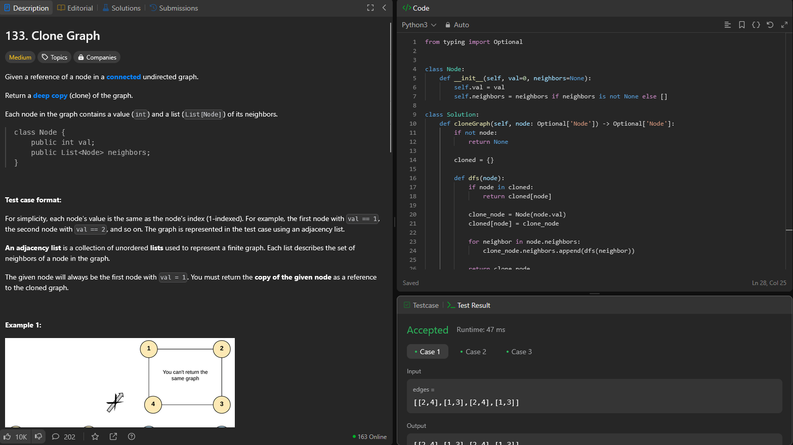

# Grafos1_Maze

**Conteúdo da Disciplina**: Grafos 1 

## Alunos
|Matrícula | Aluno |
| -- | -- |
| 211031744  |  Júlio César Costa |
| 211031403  |  Marcus Vinicius Cunha Dantas |

## Sobre 
Este projeto tem como objetivo resolver questões do leetcode relacionadas a grafos, BFS e DFS com dificuldades médias e difíceis

| Problema  | Nome                                   | Dificuldade |
|-----------|----------------------------------------|-------------|
| 2360      | [Longest Cycle in a Graph](https://leetcode.com/problems/longest-cycle-in-a-graph/description/)           | Difícil     |
| 1926      | [Nearest Exit from Entrance in Maze](https://leetcode.com/problems/nearest-exit-from-entrance-in-maze/description/) | Médio       |
| 133       | [Clone Graph](https://leetcode.com/problems/clone-graph/description/)                        | Médio       |
| 2493      | [Divide Nodes Into the Maximum Number of Groups](https://leetcode.com/problems/divide-nodes-into-the-maximum-number-of-groups/description/ )                | Difícil      |

## Screenshots

### [Longest Cycle in a Graph](https://leetcode.com/problems/longest-cycle-in-a-graph/description/)

### [Nearest Exit from Entrance in Maze](https://leetcode.com/problems/nearest-exit-from-entrance-in-maze/description/)

### [Clone Graph](https://leetcode.com/problems/clone-graph/description/)

### [Divide Nodes Into the Maximum Number of Groups](https://leetcode.com/problems/divide-nodes-into-the-maximum-number-of-groups/description/)

## Outros 

[Apresentação no youtube](https://youtu.be/-v8Zad5bvYI)

